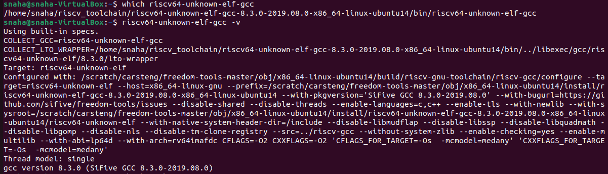
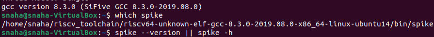
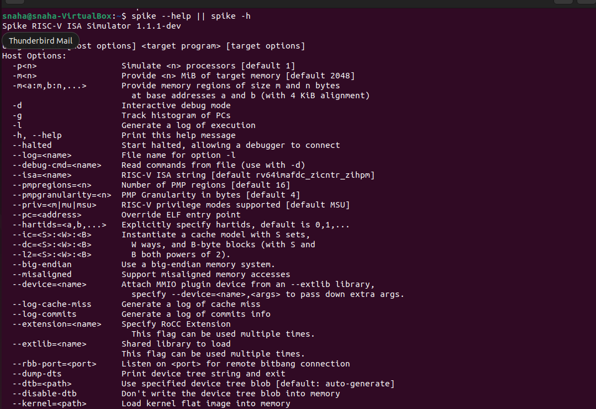
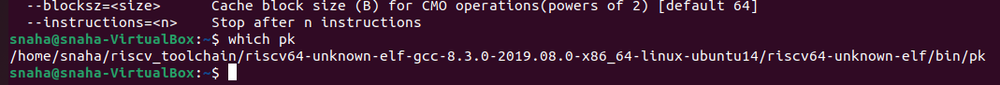

# RISC-V Toolchain Setup

## 📌 Introduction
This guide sets up a RISC-V toolchain on **Ubuntu 22.04 LTS** (native or via VirtualBox) to compile and run RISC-V programs using **Spike** (ISA simulator) and **Proxy Kernel**.

---

## ⚙️ Step-by-Step Setup

### **Before You Start**
- **Linux:** Use Ubuntu 22.04 LTS (64-bit).
- **Windows:** Install Ubuntu 22.04 in **Oracle VirtualBox** (2 vCPUs, 4–8 GB RAM, 30 GB disk).
- Run:
sudo apt-get update

## Task 1 — Install Base Developer Tools

sudo apt-get install -y git vim autoconf automake autotools-dev curl \
libmpc-dev libmpfr-dev libgmp-dev gawk build-essential bison flex \
texinfo gperf libtool patchutils bc zlib1g-dev libexpat1-dev gtkwave

## Task 2 — Create Workspace

cd
pwd=$PWD
mkdir -p riscv_toolchain
cd riscv_toolchain

## Task 3 — Get Prebuilt RISC-V GCC Toolchain

wget "https://static.dev.sifive.com/dev-tools/riscv64-unknown-elf-gcc-8.3.0-2019.08.0-x86_64-linux-ubuntu14.tar.gz"
tar -xvzf riscv64-unknown-elf-gcc-8.3.0-2019.08.0-x86_64-linux-ubuntu14.tar.gz

## Task 4 — Add Toolchain to PATH

# Current shell
export PATH=$pwd/riscv_toolchain/riscv64-unknown-elf-gcc-8.3.0-2019.08.0-x86_64-linux-ubuntu14/bin:$PATH

# Persistent
echo 'export PATH=$HOME/riscv_toolchain/riscv64-unknown-elf-gcc-8.3.0-2019.08.0-x86_64-linux-ubuntu14/bin:$PATH' >> ~/.bashrc
source ~/.bashrc

## Task 5 — Install Device Tree Compiler

sudo apt-get install -y device-tree-compiler

## Task 6 — Build and Install Spike

cd $pwd/riscv_toolchain
git clone https://github.com/riscv/riscv-isa-sim.git
cd riscv-isa-sim
mkdir -p build && cd build
../configure --prefix=$pwd/riscv_toolchain/riscv64-unknown-elf-gcc-8.3.0-2019.08.0-x86_64-linux-ubuntu14
make -j$(nproc)
sudo make install

## Task 7 — Build and Install Proxy Kernel

cd $pwd/riscv_toolchain
git clone https://github.com/riscv/riscv-pk.git
cd riscv-pk
mkdir -p build && cd build
../configure --prefix=$pwd/riscv_toolchain/riscv64-unknown-elf-gcc-8.3.0-2019.08.0-x86_64-linux-ubuntu14 --host=riscv64-unknown-elf
make -j$(nproc)
sudo make install

## Task 8 — Ensure Cross Bin Directory in PATH

# Current shell
export PATH=$pwd/riscv_toolchain/riscv64-unknown-elf-gcc-8.3.0-2019.08.0-x86_64-linux-ubuntu14/riscv64-unknown-elf/bin:$PATH

# Persistent
echo 'export PATH=$HOME/riscv_toolchain/riscv64-unknown-elf-gcc-8.3.0-2019.08.0-x86_64-linux-ubuntu14/riscv64-unknown-elf/bin:$PATH' >> ~/.bashrc
source ~/.bashrc

## Task 9 — (Optional) Install Icarus Verilog

cd $pwd/riscv_toolchain
git clone https://github.com/steveicarus/iverilog.git
cd iverilog
git checkout --track -b v10-branch origin/v10-branch
git pull
chmod +x autoconf.sh
./autoconf.sh
./configure
make -j$(nproc)
sudo make install

## Sanity Checks with outputs

command: which riscv64-unknown-elf-gcc
        riscv64-unknown-elf-gcc -v

command: which spike

command: spike --help || spike -h

command: which pk

