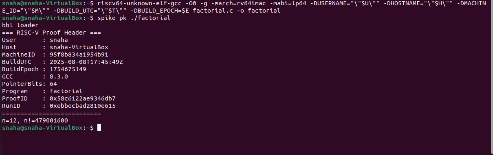

RISC-V Task 2 — Local Setup, Assembly, and Instruction Decoding

# Introduction

This project demonstrates ability to set up and use a local RISC-V toolchain, compile and run programs on the Spike RISC-V simulator, generate assembly and disassembly outputs, and manually decode RISC-V integer instructions.  
The work includes four C programs (`factorial`, `max_array`, `bitops`, `bubble_sort`), each compiled with unique build identifiers to ensure results are specific to the machine. All outputs, assembly files, and instruction decoding are included in this repository as per the given task requirements.

## 1. Spike Version
Run the command: spike --help (spike we use doesn't include spike -version command in the source code

Output: Spike RISC-V ISA Simulator 1.1.1-dev

## 2. RISC-V GCC Version

Run the command: riscv64-unknown-elf-gcc -v

Output: gcc version 8.3.0 (SiFive GCC 8.3.0-2019.08.0) 

## 3.COMPILE COMMANDS

#Common to all programs:

export U=$(id -un)
export H=$(hostname -s)
export M=$(cat /etc/machine-id | head -c 16)
export T=$(date -u +%Y-%m-%dT%H:%M:%SZ)
export E=$(date +%s)

# A)factorial
  riscv64-unknown-elf-gcc -O0 -g -march=rv64imac -mabi=lp64 -DUSERNAME="\"$U\"" -DHOSTNAME="\"$H\"" -DMACHINE_ID="\"$M\"" -DBUILD_UTC="\"$T\"" -DBUILD_EPOCH=$E factorial.c -o factorial

# B)max_array
   riscv64-unknown-elf-gcc -O0 -g -march=rv64imac -mabi=lp64 \
-DUSERNAME="\"$U\"" -DHOSTNAME="\"$H\"" -DMACHINE_ID="\"$M\"" \
-DBUILD_UTC="\"$T\"" -DBUILD_EPOCH=$E \
max_array.c -o max_array

# C)bitops
  riscv64-unknown-elf-gcc -O0 -g -march=rv64imac -mabi=lp64 -DUSERNAME="\"$U\"" -DHOSTNAME="\"$H\"" -DMACHINE_ID="\"$M\"" -DBUILD_UTC="\"$T\"" -DBUILD_EPOCH=$E bitops.c -o bitops

# D)bubble_sort
  riscv64-unknown-elf-gcc -O0 -g -march=rv64imac -mabi=lp64 -DUSERNAME="\"$U\"" -DHOSTNAME="\"$H\"" -DMACHINE_ID="\"$M\"" -DBUILD_UTC="\"$T\"" -DBUILD_EPOCH=$E bubble_sort.c -o bubble_sort

## 4. ProofID and RunID Confirmation

ProofID and RunID are printed at the top of every program’s output, confirming uniqueness of system.
For example: 

